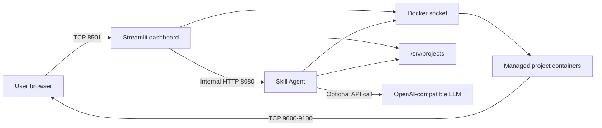

# Cloud Platform Server Handoff

Last updated: 2026-06-20

## 1. Project Goal

This project is a small Docker deployment dashboard for archiving and operating
multiple Docker Compose projects.

The current MVP provides:

- A Streamlit dashboard for registering and operating Compose projects.
- Automatic host-port allocation from `9000` through `9100`.
- Start, stop, restart, status, and log operations.
- Public frontend links for deployed services.
- A separate Skill Agent container for natural-language operations.
- Fixed, allowlisted skills instead of arbitrary shell execution.
- Dry-run, explicit approval, verification, and audit logging for mutations.
- Compact deployment and QA scripts.

Login and HTTPS are intentionally out of scope for the current MVP.

## 2. Server Layout

| Purpose | Path or name |
| --- | --- |
| Application source | `/opt/cloud_platform` |
| Streamlit source | `/opt/cloud_platform/admin.py` |
| Managed Compose projects | `/srv/projects` |
| Dashboard container | `cloud-platform-dashboard` |
| Skill Agent container | `cloud-platform-skill-agent` |
| Internal Docker network | `cloud-platform-internal` |
| Dashboard port | `8501` |
| Project port range | `9000-9100` |
| Agent audit volume | `cloud-platform-skill-agent-audit` |
| Agent environment file | `/opt/cloud_platform/.agent.env` |

The dashboard is available at:

```text
http://101.79.20.5:8501
```

The dashboard and Skill Agent use Docker restart policy `unless-stopped`.
They do not depend on `tmux` and should return after a Docker daemon or server
restart.

## 3. Runtime Architecture



The Skill Agent has no published host port. Only the dashboard can reach it
through `cloud-platform-internal`.

Important security note: both application containers currently mount the Docker
socket. Access to the Docker socket is effectively host-level privilege even
when Linux capabilities are dropped. The Skill Agent reduces application-level
risk by exposing only fixed handlers, but this is not a complete security
boundary.

## 4. Dashboard Deployment

`admin.py` exists in two relevant locations:

- Server source: `/opt/cloud_platform/admin.py`
- Dashboard container: `/app/admin.py`

The dashboard image is built from `/opt/cloud_platform/Dockerfile`.
The Dockerfile copies `admin.py` into `/app` and starts:

```bash
streamlit run admin.py \
  --server.address 0.0.0.0 \
  --server.port 8501
```

The original local deployment flow copies the repository with `rsync`:

```text
local repository -> /opt/cloud_platform -> Docker build -> /app/admin.py
```

The sync excludes `.git`, `.env.local`, caches, IDE files, and macOS metadata.
It uses `--delete`, so files removed from the source are also removed from
`/opt/cloud_platform` during a scripted deployment.

## 5. Managed Projects

Every managed project is expected to have this structure:

```text
/srv/projects/<project-name>/docker-compose.yml
```

Project and service names are read from Compose configuration. Arbitrary paths
must not be accepted from chat or Skill API input.

Host ports are allocated from `9000` through `9100`. Allocation checks both:

- Ports declared in every managed `docker-compose.yml`.
- Ports currently published by Docker containers.

NCP ACG currently permits inbound TCP:

- `22` for SSH.
- `8501` for the dashboard.
- `9000-9100` for deployed projects.

The project range is currently open to `0.0.0.0/0` for MVP testing.

## 6. Skill Agent

Source files:

```text
/opt/cloud_platform/agent/app.py
/opt/cloud_platform/agent/runtime.py
/opt/cloud_platform/agent/skills/*/SKILL.md
/opt/cloud_platform/agent/skills/*/schema.json
```

HTTP endpoints:

| Method | Endpoint | Purpose |
| --- | --- | --- |
| `GET` | `/health` | Agent and LLM configuration status |
| `GET` | `/skills` | Skill catalog |
| `POST` | `/chat` | Natural-language planning and dry-run |
| `POST` | `/execute` | Execute a selected skill |

Implemented skills:

| Skill | Mutation | Purpose |
| --- | --- | --- |
| `help.search` | No | Search local deployment documentation |
| `server.health` | No | Inspect Docker, memory, disk, and containers |
| `project.list` | No | List valid projects and services |
| `service.deploy` | Yes | Clone, build, register, and verify a new service |
| `service.status` | No | Inspect service state, health, and ports |
| `service.logs` | No | Read a bounded log tail |
| `service.control` | Yes | Start, stop, or restart a service |
| `port.suggest` | No | Find the first available port |
| `port.manage` | Yes | Change a Compose port mapping |
| `qa.run` | No | Run compact deterministic checks |

Mutation flow:

1. Validate project, service, action, and port.
2. Return a dry-run preview.
3. Require explicit approval.
4. Run a fixed Python handler.
5. Verify the resulting container state or port binding.
6. Write an audit event.
7. Roll back the Compose file when a port mutation fails verification.

The LLM is only a planner. Skills are exposed through OpenAI-compatible function
calling, and the Agent accepts only one allowlisted tool call with schema-bound
arguments. It cannot provide shell commands, arbitrary paths, Docker flags, or
executable code.

`service.deploy` accepts only public GitHub HTTPS repository URLs. It clones
into an existing managed project, requires a root-level Dockerfile, writes one
fixed Compose service definition, builds and starts that service, verifies its
published port, and rolls back the Compose file and clone on failure.

## 7. LLM Configuration

The agent works without an LLM using deterministic intent matching.

Runtime settings are stored in:

```text
/opt/cloud_platform/.agent.env
```

Do not commit or paste API keys into documentation, chat, or Git history.

Gemini can be used through its OpenAI-compatible endpoint:

```env
LLM_API_KEY=<secret>
LLM_API_URL=https://generativelanguage.googleapis.com/v1beta/openai
LLM_MODELS=gemini-3.1-flash-lite,gemini-3-flash-preview,gemini-2.5-flash,gemini-2.5-flash-lite
```

`LLM_MODEL` remains supported as a legacy single-model setting when
`LLM_MODELS` is blank. The Agent falls through the configured list only after
HTTP 429 responses. Limited models enter a cooldown so each new request does
not repeatedly consume a failed attempt. Other HTTP errors fail immediately.

After changing `.agent.env`, recreate the Skill Agent container so it receives
the new environment. A simple container restart does not reload an env file.
The existing deployment script recreates the container automatically.

Check whether the running agent sees the LLM settings:

```bash
docker exec -i cloud-platform-dashboard python - <<'PY'
import requests
print(requests.get(
    "http://cloud-platform-skill-agent:8080/health",
    timeout=5,
).json())
PY
```

Expected after configuration:

```text
{"status": "ok", "llm_configured": true}
```

## 8. Direct Server Checks

Run these before editing:

```bash
cd /opt/cloud_platform
git status --short --branch 2>/dev/null || true
docker ps --format 'table {{.Names}}\t{{.Status}}\t{{.Ports}}'
docker-compose version
swapon --show
df -h /
```

Dashboard health:

```bash
curl -fsS http://127.0.0.1:8501/_stcore/health
```

Agent health from the dashboard container:

```bash
docker exec cloud-platform-dashboard \
  python -c 'import requests; print(requests.get(
  "http://cloud-platform-skill-agent:8080/health", timeout=5).json())'
```

Recent logs:

```bash
docker logs --tail 100 cloud-platform-dashboard
docker logs --tail 100 cloud-platform-skill-agent
```

Compile checks:

```bash
python3 -m py_compile admin.py agent/app.py agent/runtime.py
```

## 9. Automated QA

The repository contains compact scripts designed to minimize diagnostic output.
They print short `OK` or `FAIL` lines and reveal detailed output only on failure.

Main scripts:

| Script | Purpose |
| --- | --- |
| `scripts/qa_fast.sh` | Health, skills, audit, and external access |
| `scripts/qa_all.sh` | Server preparation, deploy, mutation QA, and full checks |
| `scripts/remote_healthcheck.sh` | Container and network health |
| `scripts/remote_smoke_test.sh` | Dashboard behavior and Python checks |
| `scripts/remote_skill_test.sh` | Read-only skills and approval guard |
| `scripts/remote_skill_mutation_test.sh` | Isolated start/stop/restart/port test |
| `scripts/remote_audit.sh` | Swap, restart policy, disk, ports, and Docker audit |
| `scripts/remote_logs.sh` | Short dashboard and agent logs |

The older remote scripts were designed to run from a local repository and SSH
to the NCP server using `.env.local`. They are retained as legacy utilities.
The current source of truth is the Git repository on the server. Do not use the
rsync deployment flow unless it is deliberately being migrated or removed.

Server-native mutation QA:

```bash
cd /opt/cloud_platform
./scripts/server_skill_mutation_test.sh
```

This creates only `/srv/projects/skill-qa`, tests natural-language deploy,
stop, start, and port change operations, runs deterministic QA, and cleans up
the temporary project on exit.

Full local workflow:

```bash
cd /path/to/local/cloud_platform_editable
./scripts/qa_all.sh
```

Fast local verification:

```bash
./scripts/qa_fast.sh
```

The mutation QA creates a temporary `/srv/projects/skill-qa` project, tests
start, stop, restart, and port changes, and removes it on exit.

## 10. Last Verified State

The following behavior was verified during the MVP work:

- Dashboard container remains running with `restart: unless-stopped`.
- Skill Agent remains running and has no host port.
- Dashboard health endpoint responds.
- Dashboard can access Docker.
- Agent skill catalog contains all nine expected skills.
- Read-only skills execute successfully.
- Mutations are rejected without explicit approval.
- Start, stop, restart, and port-change verifiers pass in an isolated project.
- No unhealthy or restarting containers were present.
- Duplicate managed Compose host ports were not present.
- External access to the dashboard and deployed demo ports worked.
- `demoa` frontend and backend used host ports `9001` and `9000`.
- The previous `demo-a` Nginx upstream mismatch was changed from `backend` to
  `demo-b`.
- Server swap is configured as 2 GB.

Treat this as a handoff snapshot, not proof of current runtime state. Re-run the
checks before making changes.

## 11. Git State at Handoff

The local branch was three commits ahead of `origin/main`:

```text
93bde15 Add verified Skill Agent and Streamlit assistant
5e02e63 Add resilient service start and compact server QA
01154a6 Fix host port allocation and service links
```

The earlier deployment workflow commit is:

```text
262f561 Add Dockerized NCP deployment and QA workflow
```

Confirm whether these commits have since been pushed before pulling, resetting,
or overwriting server files. Never discard uncommitted server changes without
reviewing them.

## 12. Recommended Next Work

1. Configure the Gemini API values in `.agent.env`.
2. Recreate the Skill Agent and verify `llm_configured: true`.
3. Test Korean natural-language requests for every skill.
4. Add compact LLM routing tests with mocked responses.
5. Improve chat error messages for quota errors, malformed plans, and timeouts.
6. Decide whether server-native Git or local-to-server `rsync` is the source of
   truth. Do not mix both workflows without checking diffs.
7. Add authentication and HTTPS only after the skill MVP is stable.
8. Restrict public ACG sources before treating the system as production.
9. Replace or proxy raw Docker socket access before allowing untrusted users.

## 13. Rules for the Next Agent

- Read this document and `README_DEV.md` before editing.
- Inspect current Git and Docker state first.
- Preserve `/srv/projects` unless the user explicitly requests project removal.
- Never expose `.agent.env`, `.env.local`, passwords, or API keys.
- Do not execute LLM-generated shell commands.
- Keep mutations behind preview, explicit approval, and verification.
- Add or update a compact QA script when adding a new skill.
- Run focused checks after each change and full QA before declaring completion.
- Do not delete unrelated files or revert changes that were not made by you.
- Report exact commands, changed files, and QA results in the final handoff.
