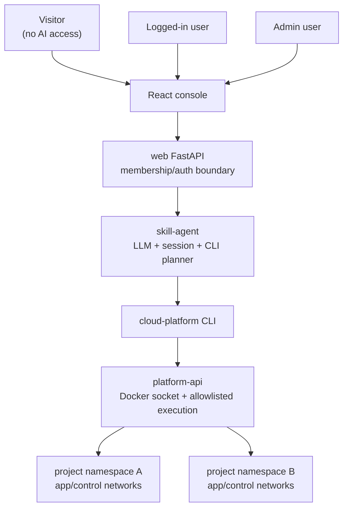

# React console migration

This is the first migration layer from the Streamlit admin dashboard to a
React + FastAPI console.

## Current target architecture



## Permission model

- Visitor: can view public/landing content only. No AI agent.
- User: can create projects through explicit UI/API, then use the agent inside
  project detail pages.
- Admin: can access every project and the root/admin agent.

The initial implementation uses development headers:

- `X-User-Role: visitor | user | admin`
- `X-User-Id: local-user`

Real login can replace this boundary later without changing the project agent
or platform execution layers.

## Development workflow

Because the current VM has only about 10GB disk, avoid installing Node
dependencies or building React on the server.

Recommended flow:

1. Pull this repo on the local Mac.
2. Run frontend commands locally:

   ```bash
   cd frontend
   npm install
   npm run dev
   npm run build
   ```

3. Copy only build output to the server:

   ```bash
   rsync -avz frontend/dist/ root@SERVER_IP:/opt/cloud_platform/frontend/dist/
   ```

4. Serve `frontend/dist` from nginx or a small static file container.

## Server-side smoke test

The server can validate Python syntax and existing platform QA without touching
Node dependencies:

```bash
python3 -m py_compile web/app.py
./scripts/server_qa_all.sh --fast
```

## Optional server API container

The web API should run inside the existing Docker network so it can resolve the
skill agent by container DNS:

```bash
./scripts/run_react_console_api.sh
```

This publishes only the web API on `:8000`. It does not install or build the
React frontend on the server.
